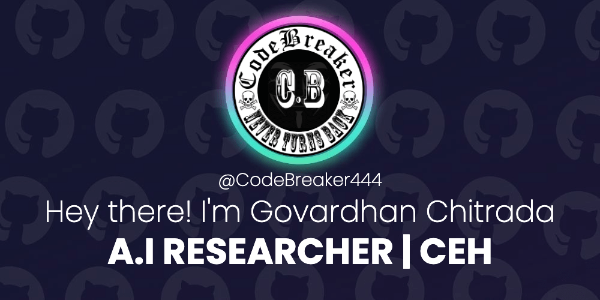

 &nbsp 

<h4 align="justify" >A passionate A.I researcher with immense background in pentesting and programming in various technology fields. To test my skills, I officially became C.E.H at the age of 19 and from that time, my journey towards my goal has become more apparent. Because of my field in security, it's my obligation to get my expertise in FULL STACK development. My thought process always made me look into an all in one solution for security and development overhead which lead me to Artificial Intelligence. To gain academic knowledge related to state-of-art A.I research, I'm pursuing my masters in ARTIFICIAL INTELLIGENCE AND ROBOTICS (University Of Rome).
<h4>

***

<h2 align="center">Stats & Updates</h2>

    

- 🌱 I’m currently working on **3D Models, VR Rendering, World Space**

- 👨‍💻 All of my projects are available at [https://govardhanchitrada.com](https://govardhanchitrada.com)

- 📝 I regulary write articles on [https://blog.govardhanchitrada.com](https://blog.govardhanchitrada.com)

- 💬 Ask me about **binary exploitation, reverse engineering and ofcourse Deeplearning.**

- 📫 How to reach me **zeroerror.444@gmail.com**

- ⚡ Fun fact **I completed watching over 30 webseries on various streaming platforms.**

***

<h2 align="center">My latest writings</h3>
<!-- BLOG-POST-LIST:START -->
 
 - [Human Interaction and Light🔦 sensing four-wheeled robot🤖 with Emotion Detection - Computer Vision](https://codebreaker444.github.io/light-sensing-emotion-detection-robotics-ai-emotion/)
 
 - [Hybrid Convolutional Neural Network🧬 for Face Mask😷 detection and face cover detection🕵🏻‍♂️](https://codebreaker444.github.io/Hybrid-face-mask-detection-with-CNN/)
 
 - [Solving💪🏻 Mountain Car🚙 Continuous problem using Proximal Policy Optimization - Reinforcement Learning](https://codebreaker444.github.io/mountain-car-continuous-ppo-reinforcement-learning/)
 
 - [Optimistic Adaptive Accelaration For Optimization on CIFAR-10 dataset🐶🐈🚘✈️ for image classification - Computer Vision](https://codebreaker444.github.io/optimistic-adaptive-acceleration-for-optimization-cifar10/)<!-- BLOG-POST-LIST:END -->

***
<h2 align="center">Metrics</h3>

  

***

<h2 align="center">Languages and Tools</h3>

                                                              

***

<h2 align="center">Connect with me</h3>

***

<h2 align="center">Support</h3>

  
 
